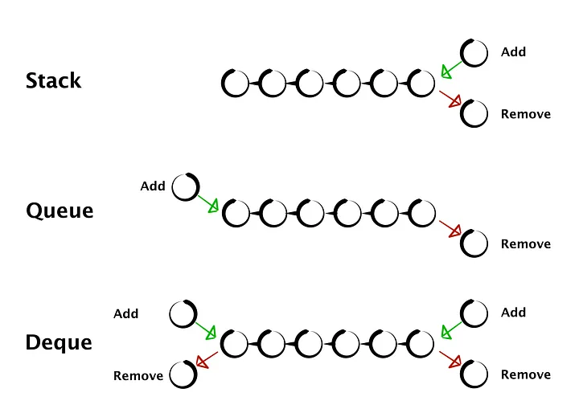

# Deque 

https://medium.com/@rasmussen.matias/fun-with-deques-in-python-31942bcb6321

The deque allows you to add and remove elements from both the head and the tail in constant time, unlike the list which only has constant time operations for adding and removing element at the tail of the list.

The stack allow you to add and remove elements from one end and the queue allows adding at one end and removing from the other end. So stacks and queues are just degenerate forms of the the deque.

The deque is thread-safe, so the elements can be removed from both ends of the deque concurrently by several threads.

You can restrict the capacity of the deque in python using the maxlen parameter. When the elements are added to a full deque, elements at the opposite end are discarded.

Example 1:

You need to keep track of a customer’s navigation history and maintain a sequence of the last 5 viewed products.

